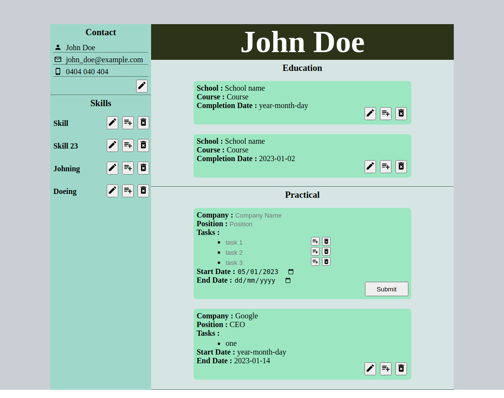

[![Contributors][contributors-shield]][contributors-url]
[![Forks][forks-shield]][forks-url]
[![Stargazers][stars-shield]][stars-url]
[![Issues][issues-shield]][issues-url]
[![MIT License][license-shield]][license-url]
[![LinkedIn][linkedin-shield]][linkedin-url]

<!-- PROJECT LOGO -->
 

  

<h3 align="center">CV-Project</h3>

  

    CV Project created for The Odin Project
     
    <a href="https://github.com/sirjamo1/cv-project"><strong>Explore the docs »</strong></a>
     
     
    <a href="https://github.com/sirjamo1.io/cv-project">View Demo</a>
    ·
    <a href="https://github.com/sirjamo1/cv-project/issues">Report Bug</a>
    ·
    <a href="https://github.com/sirjamo1/cv-project/issues">Request Feature</a>
  

<!-- TABLE OF CONTENTS -->

  
Table of Contents

  <ol>
    <li>
      <a href="#about-the-project">About The Project</a>
      <ul>
        <li><a href="#built-with">Built With</a></li>
      </ul>
    </li>
    <li><a href="#usage">Usage</a></li>
    <li><a href="#roadmap">Roadmap</a></li>
    <li><a href="#contact">Contact</a></li>
    <li><a href="#acknowledgments">Acknowledgments</a></li>
  </ol>

<!-- ABOUT THE PROJECT -->

## About The Project

CV creator made for The Odin Project

<ol>
<li>Create a new project using npx create-react-app cv-project. If you need a reminder on how it works, check out the previous lessons. Don’t forget to setup a GitHub repository for your project, to push your progress.</li>
<li>Remove the boilerplate code created by create-react-app.</li>
<li>You should use class components for this project. You’re going to find a lot of code written using class components and this practical experience will help you understand it when encountered. You’ll also revisit this project in a later lesson to replace the class components with functional ones.</li>
<li>Think about how to structure your application into components. Your application should include: 
   <ol>
      <li>A section to add general information like name, email, phone number.</li>
      <li>A section to add your educational experience (school name, title of study, date of study)</li>
      <li>A section to add practical experience (company name, position title, main tasks of your jobs, date from and until when you worked for that company)</li>
      </ol>
      </li>
<li>Be sure to include an edit and submit button for each section or for the whole CV, your preference. The submit button should submit your form and display the value of your input fields in HTML elements. The edit button should add back (display) the input fields, with the previously displayed information as values. In those input fields, you should be able to edit and resubmit the content. You’re going to make heavy use of state and props, so make sure you understood those concepts.</li>
<li>Create a components folder in your src directory and add your components.</li>
<li>Include a styles folder in your src directory for your CSS files. You’ll need to import these in the component files to use them.</li>
<li>Don’t forget to push your solution to GitHub. You should be proud of your work and show it off to the world!</li>
</ol>

(<a href="#readme-top">back to top</a>)

### Built With

-   [![React][react.js]][react-url]

(<a href="#readme-top">back to top</a>)

## Usage

Can use to create basic CV.

-   Add/edit/delete user information

(<a href="#readme-top">back to top</a>)

<!-- ROADMAP -->

## Roadmap

-   Ability to add a photo
-   Ability to be able to save as PDF

(<a href="#readme-top">back to top</a>)

<!-- CONTACT -->

## Contact

James Howells - jam_how@hotmail.com

Project Link: [https://github.com/sirjamo1/cv-project](https://github.com/sirjamo1/cv-project)

(<a href="#readme-top">back to top</a>)

<!-- ACKNOWLEDGMENTS -->

## Acknowledgments

-   Icons from https://materialdesignicons.com/

(<a href="#readme-top">back to top</a>)

<!-- MARKDOWN LINKS & IMAGES -->
<!-- https://www.markdownguide.org/basic-syntax/#reference-style-links -->

[contributors-shield]: https://img.shields.io/github/contributors/sirjamo1/cv-project.svg?style=for-the-badge
[contributors-url]: https://github.com/sirjamo1/cv-project/graphs/contributors
[forks-shield]: https://img.shields.io/github/forks/sirjamo1/cv-project.svg?style=for-the-badge
[forks-url]: https://github.com/sirjamo1/cv-project/network/members
[stars-shield]: https://img.shields.io/github/stars/sirjamo1/cv-project.svg?style=for-the-badge
[stars-url]: https://github.com/sirjamo1/cv-project/stargazers
[issues-shield]: https://img.shields.io/github/issues/sirjamo1/cv-project.svg?style=for-the-badge
[issues-url]: https://github.com/sirjamo1/cv-project/issues
[license-shield]: https://img.shields.io/github/license/sirjamo1/cv-project.svg?style=for-the-badge
[license-url]: https://github.com/sirjamo1/cv-project/blob/master/LICENSE.txt
[linkedin-shield]: https://img.shields.io/badge/-LinkedIn-black.svg?style=for-the-badge&logo=linkedin&colorB=555
[linkedin-url]: https://linkedin.com/in/linkedin_username
[product-screenshot]: images/screenshot.png
[next.js]: https://img.shields.io/badge/next.js-000000?style=for-the-badge&logo=nextdotjs&logoColor=white
[next-url]: https://nextjs.org/
[react.js]: https://img.shields.io/badge/React-20232A?style=for-the-badge&logo=react&logoColor=61DAFB
[react-url]: https://reactjs.org/
[vue.js]: https://img.shields.io/badge/Vue.js-35495E?style=for-the-badge&logo=vuedotjs&logoColor=4FC08D
[vue-url]: https://vuejs.org/
[angular.io]: https://img.shields.io/badge/Angular-DD0031?style=for-the-badge&logo=angular&logoColor=white
[angular-url]: https://angular.io/
[svelte.dev]: https://img.shields.io/badge/Svelte-4A4A55?style=for-the-badge&logo=svelte&logoColor=FF3E00
[svelte-url]: https://svelte.dev/
[laravel.com]: https://img.shields.io/badge/Laravel-FF2D20?style=for-the-badge&logo=laravel&logoColor=white
[laravel-url]: https://laravel.com
[bootstrap.com]: https://img.shields.io/badge/Bootstrap-563D7C?style=for-the-badge&logo=bootstrap&logoColor=white
[bootstrap-url]: https://getbootstrap.com
[jquery.com]: https://img.shields.io/badge/jQuery-0769AD?style=for-the-badge&logo=jquery&logoColor=white
[jquery-url]: https://jquery.com
